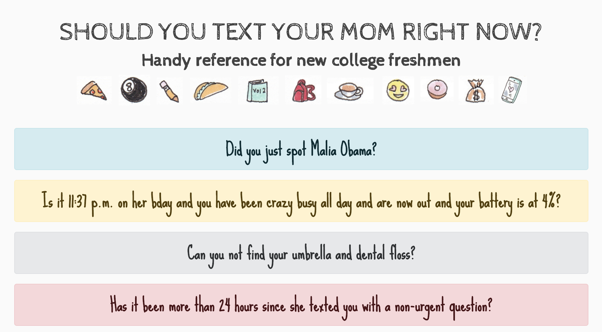

# Should You Text Your Mom Right Now?
> An easy to use application that allows you to plan a school's classes with multiple students

Should You Text Your Mom Right Now? is a Handy App for New College Freshmen (Based off of Beth Wolfensberger Singer’s satirical comic) Users can:

* Click through questions
* See both yes and no responses
* Return back to start
* Have fun!

> [Demo Here](http://melindashaw-deploy-qtr1-project.surge.sh/)

## Installation

Launch website with your favorite browser. Begin clicking on questions and their answers will appear!

## Next Steps

- [ ] Have questions that have been looked at not reappear
- [ ] Make secondary questions appear and click through to reveal more layers
- [ ] Have user add their own questions and answers
